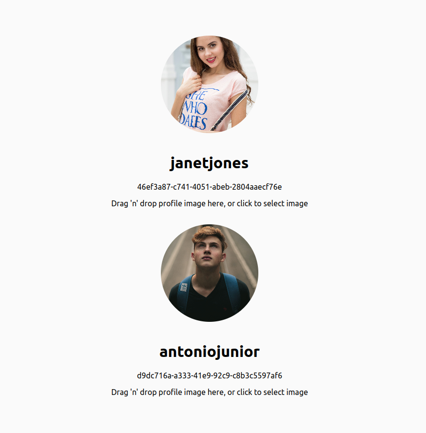

# S3-upload-download

The frontend was written in React 

## How to run the frontend-app:

- You must have `NodeJS` and `npm` installed in your PC

```script
sudo apt install nodejs
```

- Execute this command in the root workspace to download `node_modules` folder

```script
npm install
```

- Execute this command to get the `React Application` up and running

```script
npm start
```

- Home Page of Front-End to drag 'n' drop files to S3 



# UserProfileApi

This project was written in Spring Boot with Web and AWS Java Sdk

## How to run this api:

- You must have Java 11 installed in your PC. If you have SDK Man, run this command in the same folder which is `pom.xml` file

```script 
sdk use java 11.0.2-open
```

- And then execute this command 

```script
mvn spring-boot:run
```

- And the api will be served in the `localhost:8080`

Eg.:`http://localhost:8080/api/v1/user-profiles`